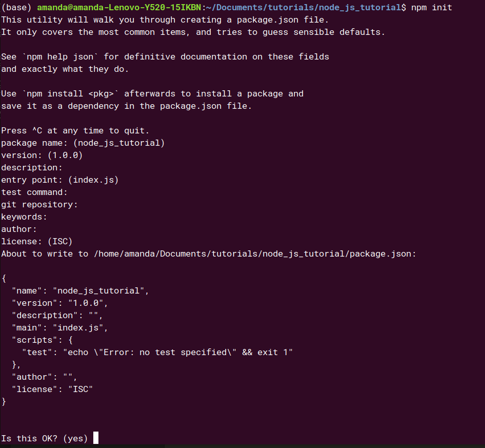

# Node.JS tutorial


## Installation

An the [Node.Js website](https://nodejs.org/en/) you can download the LTS version or the latest version. It's preferable for the common user to use the LTS version. At the moment it's 12.13.0

the current version that I use for this tutorial is 8.10.0, do not blame please !

The tutorial is done on Ubuntu 18.04

## Hello world HTTP server

after installing Node.Js, check that node and npm are installed. With Ubuntu 18.04 open the terminal then type
`node -v `and `npm -v`

In this part, we will create a simple HTTP server listening to port 3000, which send hello world to the browser !

The HTTP module is a core module in Node.Js, which means it does not need installation using npm. You can use it directly with the command

```javascript
const http= require('http'); // Load the http module
```

### create project

to create a nodejs project, use npm to init the project with the following command line:

```npm init```

you will have the followin these steps :



create a JS file with the name 0001_hello_world_http_server.js

you can find the full documentation of the http module in this [link](https://nodejs.org/api/http.html)

to create a HTTP server, you will have to use the function createServer(req, res) inside the function

use the function writeHead to describe the type, code message of your response.

use write to write your answer

use end function to tell the server that all the responses have been sent.

use the listen function with the port_id=3000 to make the server listen to the port 3000.

run you code using the command line ```node 0001_hello_world_http_server.js ```

The created server can be accessed with url [http://127.0.0.1:3000/](http://127.0.0.1:3000/) or  [http://localhost:3000/](http://localhost:3000/)

the result:


## Debugging NodeJS application
Install globally the node-inspector module with:
```
    npm install -g node-inspector
```

and then use
```node-debug 0001_hello_world_http_server.js ```

or use the built-in inspector with the option --inspect

 ```node 0001_hello_world_http_server.js --inspect```


 ## hello world with express

Express is a commonly-used web framework that is useful for creating HTTP APIs. Use npm to install express module
 ```npm install --save express``` from the command line.
 Refer to [this documentation](https://docs.npmjs.com/cli/install) for more information on how to install packages.

create a new JS file with the name: 0002_hello_world_with_express.js

to use express write:
```JS
    const express= require('express'); // Load express module
```

to route the HTTP request to '/' we use the get method and in the callback send the response

```JS
app.get('/', function(req, res) {
    res.send('Hello, World!');
});
```

then make the app listen to the port 3000

```JS
app.listen(port_id,()=>{
    console.log('Server listening on http://localhost:'+port_id);
})
```

# Hello world with basic routing

once you understand how to create an HTTP server, you have to understand how to make it don things based on path that a user has navigated through

create a new JS file 0003_hello_world_basic_routing.js

then execute the command: ``` node 0003_hello_world_basic_routing.js ```

when you try to access the url localhost:3000 you get an answer but with url localhost:3000/slope you get not found!


to not create a very large callback function we will create a routes object containing all the possible routes with the answer to each one

```JS
let routes={
    '/':function(req,res){
        res.writeHead(200);
        res.end('Hello, world!');
    },
    '/slope':function(req,res){
        res.writeHead(200);
        res.end('This is your slope :-inf // may the force be with you always');
    }
}
```

then change the callback function to:
```JS
    http.createServer((req,res)=>{
    if (req.url in routes){
        return routes[req.url](req,res);
    }

    res.writeHead(404);
    res.end(http.STATUS_CODES[404]);
}).listen(port_id);
```