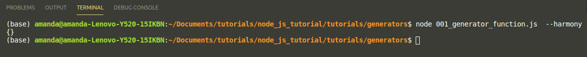
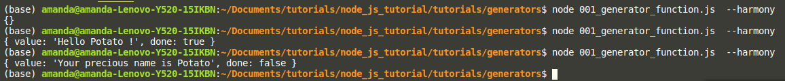
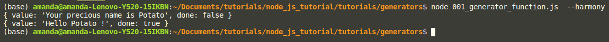

# Generators


## Introduction

Generators are a special kind of function that can be started, paused and resumed


A regular function

```JS
var hello = function(name){
    return 'Hello '+name+' !';
}
console.log(hello('Potato'));

```

to use a generator just add * after the function name, as shown below:

```JS
var hello = function *(name){
    return 'Hello '+name+' !';
}
console.log(hello('Potato'));

```

When you run the code using the command
```
node 001_generator_function.js  --harmony
```

--harmony is a nodejs option to enable all harmony features

you get the result:



We are actually creating a generator object, not calling the function, to run the function, we must use the next function.

just like shown below:

```JS
var hello = function *(name){
    return 'Hello '+name+' !';
}
var gen = hello('Potato');
console.log(gen.next());
```
the execution of this code, return an object with two attributes. the value which was returned from the execution of next function and done attribute which is a boolean.
Done represent the completion of the generator or not.

So... what have we done till now ? just create a generator function and run the generator to completion. Well, we talked earlier about stoping and resuming the generator function.

We do that with the keyword yield,

```JS
var hello = function *(name){
    yield 'Your precious name is '+name;
    return 'Hello '+name+' !';
}

var gen = hello('Potato');
console.log(gen.next());
```

When, we run the code again. The result of the next is an object with the same two attributes but done is set to false this time. Which means the generator did not run into completion



To restart the generator, just call next again.

```JS
var hello = function *(name){
    yield 'Your precious name is '+name;
    return 'Hello '+name+' !';
}

var gen = hello('Potato');
console.log(gen.next());
// Restart the generator with next
console.log(gen.next());
```
The result:


This time as you can see when we run the second next, the generator run into completion.


## How does it help me ?


What, we did show you till now, is quite interesting but does not really show how it can help me.

Well if you intend to do asynchronous programming and you intend to avoid using callbacks function. It really does help.

The generators function cannot control itself, rather it is controlled by the outside